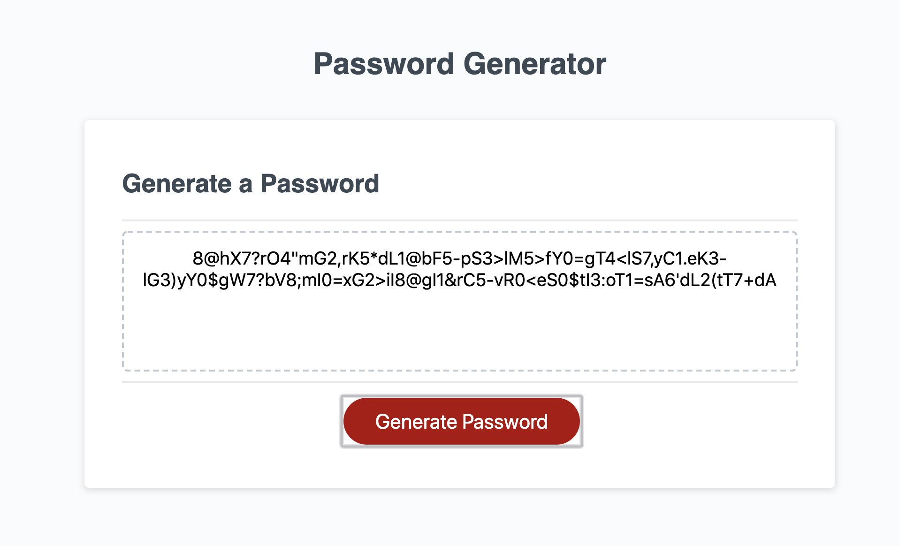

# Password Generator Read Me

## Summary

This website can generate an alpha numeric password between 8 and 128 characters. 

The page prompts the user to specify the required length of the password. Ther user is then prompted through 4 questions that ask whether the password should include:
- upper case letters
- lower case letters
- numbers
- special characters


## Site Picture



## Technologies Used
- Javascript - used to build password functions
- HTML - used to create elements
- CSS - for styles elements on page
- Git - version control system to track changes to source code
- GitHub - hosts repository that can be deployed in GitHub pages

## Code Snippet

The code highlighted below show the biggest challenges I overcame when creating the website.


```Code snippet
function joinChars(requirements, length) {

// First, a verb to store the password string is generated
  var joinedText = "";
  
// This variable houses the names of the functions that generate different char values
  var userOptionFunctions = [generateNumber, generateSpecialChar, generateLowerCase, generateUpperCase];
  
// true User Reqs is a list that will house all requirements that user selected as true
  
  var trueUserReqs = [];
  
// this for loop iterates over the requirements and adds values to the true user reqs
  for (let i = 0; i < requirements.length; i++) {
    if (requirements[i]) {
      textGenerator.push(userOptionFunctions[i]);
    }
  }
```

## Author Links
- [LinkedIn](https://www.linkedin.com/in/ana-medrano-fernandez/)

- [GitHub](https://github.com/analoo)